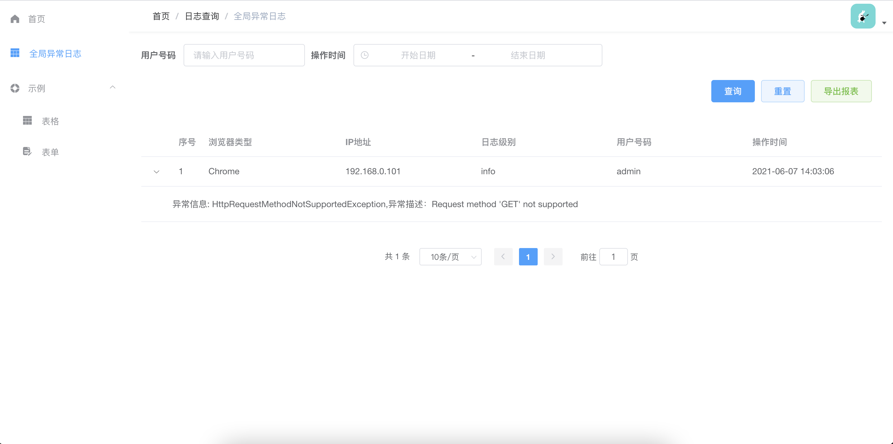

# 简介
该项目是SpringBoot-jpa整合Vue，一个后台管理项目模板。即开即用；写这个项目，一是为了快速开发小型项目，二是为了方便小白快速上手,当一个教程。

项目运行效果图：


## 后端
为了简化开发，项目中封装了一些代码：包括但不限于全局处理异常、导出报表、常用工具类。

项目使用Oracle数据库，当然这只是举个例子，如果需要多数据源或者MySql、SqlServer请自行配置。

**注：项目没有完整的用户登陆功能，如需要请自行使用框架完善。**

### 目录结构
```
├── ServerApplication.java
├── annotation
│   ├── Facade.java
│   └── FacadeAspect.java
├── config
│   └── WebMvcConfig.java
├── controller
│   └── SysWebLogController.java
├── exception
│   ├── BaseException.java
│   ├── NotFoundException.java
│   └── handler
│       └── GlobalExceptionHandler.java
├── model
│   ├── ApiRequest.java
│   ├── ApiResponse.java
│   ├── entity
│   │   └── SysWebLogEntity.java
│   └── params
│       └── WebLogQuery.java
├── repository
│   ├── SysWebLogRepository.java
│   └── base
│       ├── BaseRepository.java
│       └── BaseRepositoryImpl.java
├── service
│   ├── ISysWebLogService.java
│   ├── base
│   │   ├── AbstractCrudService.java
│   │   ├── BaseQueryCondition.java
│   │   ├── BuilderConditions.java
│   │   ├── BuilderPredicate.java
│   │   └── CrudService.java
│   └── impl
│       └── SysWebLogServiceImpl.java
├── support
│   ├── IStatus.java
│   └── Status.java
└── utils
    ├── BeanValidator.java
    ├── BrowseUtils.java
    ├── DateUtils.java
    ├── IPUtils.java
    ├── ObjectUtils.java
    ├── OptionalBean.java
    └── SeqGenUtils.java
```

## 前端
前端项目参照[vue-admin-template](https://github.com/PanJiaChen/vue-admin-template) 有改动。


### 介绍

> 这是一个极简的 vue admin 管理后台。它只包含了 Element UI & axios & iconfont & permission control & lint，这些搭建后台必要的东西。

[线上地址](http://panjiachen.github.io/vue-admin-template)

[国内访问](https://panjiachen.gitee.io/vue-admin-template)

目前版本为 `v4.0+` 基于 `vue-cli` 进行构建，若你想使用旧版本，可以切换分支到[tag/3.11.0](https://github.com/PanJiaChen/vue-admin-template/tree/tag/3.11.0)
它不依赖 `vue-cli`。

### 注意

如果你想要根据用户角色来动态生成侧边栏和 router，你可以使用该分支[permission-control](https://github.com/PanJiaChen/vue-admin-template/tree/permission-control)

### 启动步骤

```bash
# 克隆项目
git clone https://github.com/PanJiaChen/vue-admin-template.git

# 进入项目目录
cd vue-admin-template

# 安装依赖
npm install

# 建议不要直接使用 cnpm 安装以来，会有各种诡异的 bug。可以通过如下操作解决 npm 下载速度慢的问题
npm install --registry=https://registry.npm.taobao.org

# 启动服务
npm run dev
```

浏览器访问 [http://localhost:9528](http://localhost:9528)

### 打包

```bash
# 构建测试环境
npm run build:stage

# 构建生产环境
npm run build:prod
```

### 其它

```bash
# 预览发布环境效果
npm run preview

# 预览发布环境效果 + 静态资源分析
npm run preview -- --report

# 代码格式检查
npm run lint

# 代码格式检查并自动修复
npm run lint -- --fix
```

更多信息请参考 [使用文档](https://panjiachen.github.io/vue-element-admin-site/zh/)


### 演示


### 支持浏览器

Modern browsers and Internet Explorer 10+.

| [](http://godban.github.io/browsers-support-badges/)</br>IE / Edge | [](http://godban.github.io/browsers-support-badges/)</br>Firefox | [](http://godban.github.io/browsers-support-badges/)</br>Chrome | [](http://godban.github.io/browsers-support-badges/)</br>Safari |
| --------- | --------- | --------- | --------- |
| IE10, IE11, Edge| last 2 versions| last 2 versions| last 2 versions


